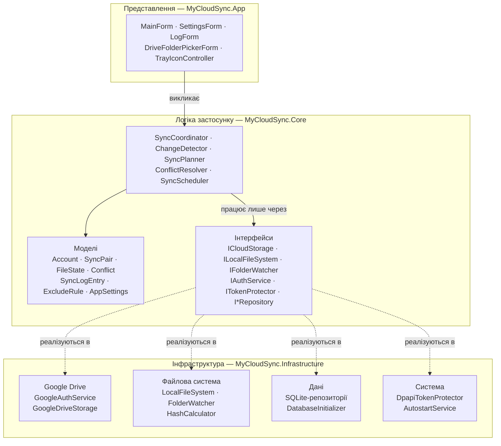
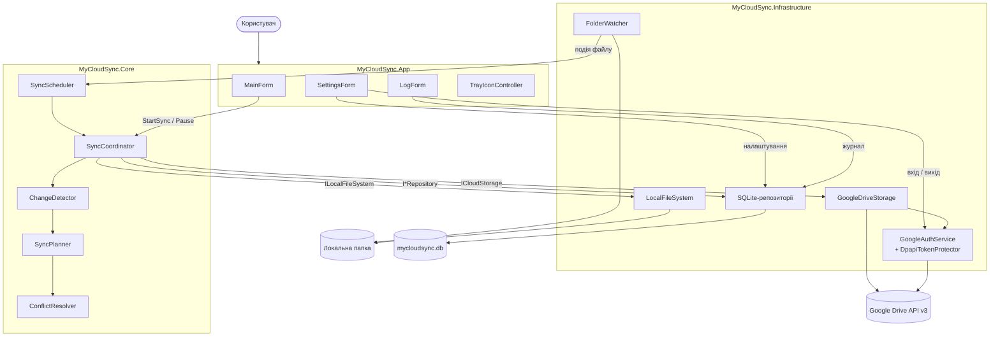
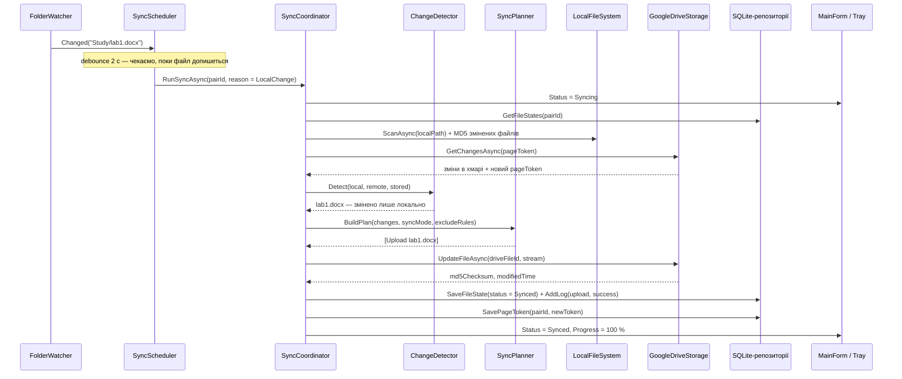
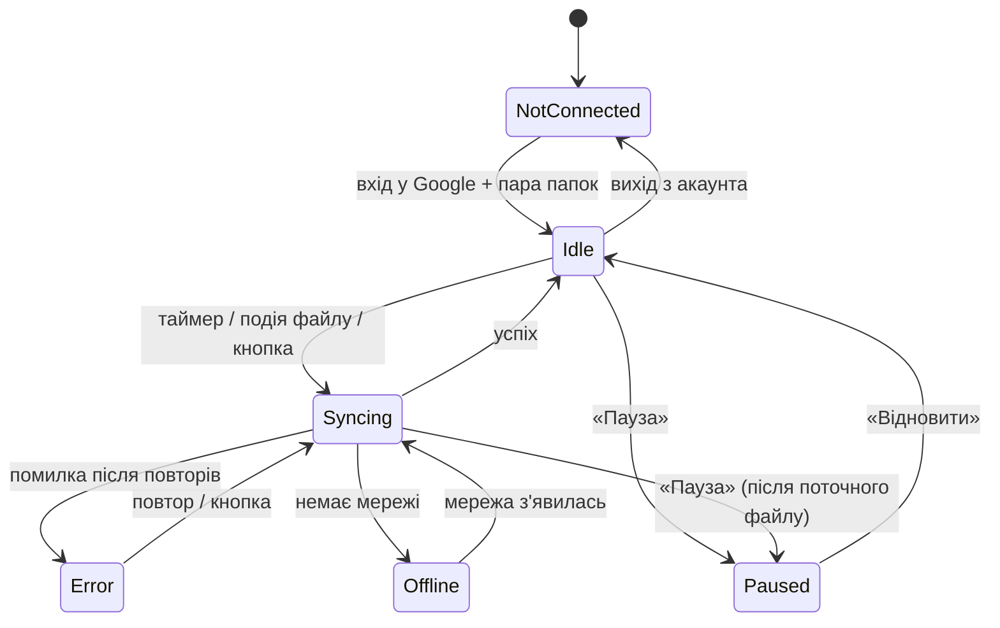
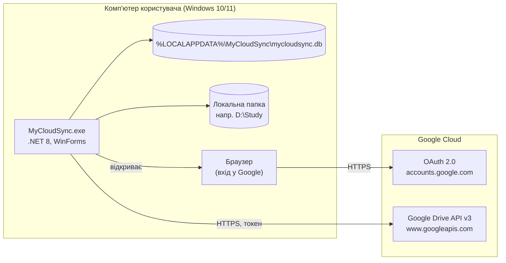
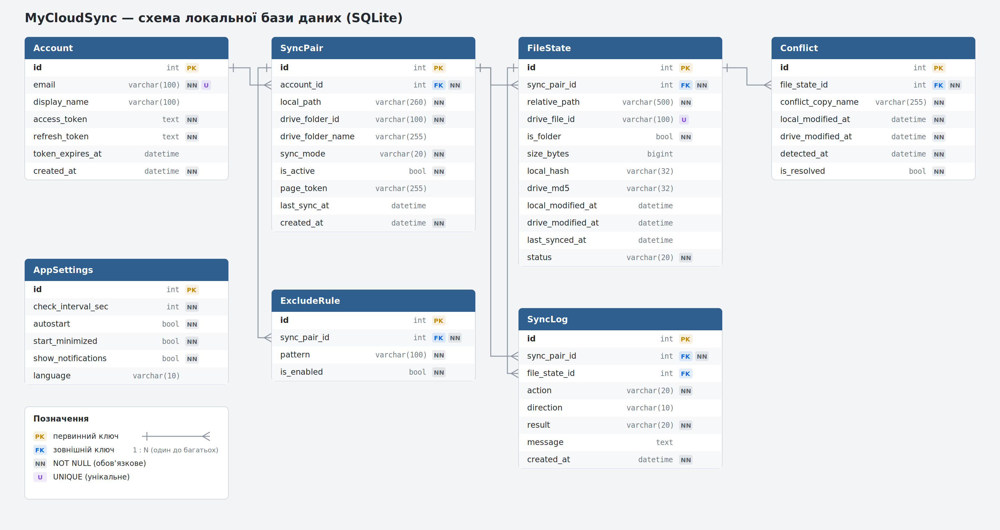

# Архітектура MyCloudSync

Документ описує архітектуру настільного застосунку MyCloudSync: обраний підхід, структуру рішення, компоненти та їхню відповідальність, взаємодію компонентів і модель даних. Обґрунтування ключових рішень винесено в [decisions.md](decisions.md), детальну модель даних — у [data-model.md](data-model.md).

Документ спирається на вимоги з `docs.md` (FR-01 – FR-16, NFR-01 – NFR-08) та матеріали етапу моделювання в `docs/design/`.

## 1. Архітектурний підхід

MyCloudSync побудовано як **багатошаровий (layered) застосунок** із принципом **інверсії залежностей** (елементи підходу Ports & Adapters). Застосунок складається з чотирьох шарів:

| Шар | Проєкт | Що містить | Від чого залежить |
|---|---|---|---|
| Представлення (Presentation) | `MyCloudSync.App` | Форми WinForms, іконка в треї, запуск програми, налаштування DI | Core, Infrastructure (лише в точці збирання) |
| Логіка застосунку (Core) | `MyCloudSync.Core` | Моделі предметної області, інтерфейси, логіка синхронізації | Ні від чого |
| Інфраструктура (Infrastructure) | `MyCloudSync.Infrastructure` | Google Drive API, файлова система, SQLite, DPAPI, автозапуск | Core |
| Тести | `MyCloudSync.Tests` | Модульні тести логіки синхронізації | Core |

Головне правило: **Core не знає ні про WinForms, ні про Google, ні про SQLite**. Він описує, що йому потрібно, через інтерфейси (`ICloudStorage`, `IFileStateRepository` тощо), а Infrastructure ці інтерфейси реалізує. Компоненти з'єднуються через контейнер залежностей (`Microsoft.Extensions.DependencyInjection`) у `Program.cs`.



**Чому саме так:**

- Логіку синхронізації (найскладнішу частину) можна тестувати без інтернету, Google-акаунта та бази даних: у тестах інтерфейси підміняються фейковими реалізаціями.
- Кожен учасник команди працює у своєму шарі й не заважає іншим (див. розділ 3).
- Заміна Google Drive на інше сховище (OneDrive, Dropbox) торкнулася б лише одного класу в Infrastructure. Це не вимога проєкту, але добра перевірка якості архітектури (NFR-07).

Розглянуті альтернативи та причини відмови — у [decisions.md, ADR-01](decisions.md#adr-01-багатошарова-архітектура-з-інверсією-залежностей).

## 2. Структура рішення

Рішення Visual Studio `MyCloudSync.sln`, платформа **.NET 8** (`net8.0-windows` для App, `net8.0` для Core).

```text
MyCloudSync/
├── MyCloudSync.sln
├── src/
│   ├── MyCloudSync.App/                  # WinForms (Presentation)
│   │   ├── Program.cs                    # точка входу, DI-контейнер, один екземпляр програми
│   │   ├── Forms/
│   │   │   ├── MainForm.cs               # статус, пара папок, «Синхронізувати зараз», «Пауза»
│   │   │   ├── SettingsForm.cs           # папки, режим, інтервал, маски, автозапуск
│   │   │   ├── LogForm.cs                # журнал операцій (DataGridView + фільтр)
│   │   │   └── DriveFolderPickerForm.cs  # вибір / створення папки на Google Drive
│   │   ├── Tray/TrayIconController.cs    # NotifyIcon, меню трею, сповіщення
│   │   └── Resources/                    # іконки станів
│   │
│   ├── MyCloudSync.Core/                 # логіка застосунку, без зовнішніх залежностей
│   │   ├── Models/                       # Account, SyncPair, FileState, Conflict,
│   │   │                                 # SyncLogEntry, ExcludeRule, AppSettings, enum-и
│   │   ├── Abstractions/                 # ICloudStorage, ILocalFileSystem, IFolderWatcher,
│   │   │                                 # IAuthService, ITokenProtector, IAutostartService,
│   │   │                                 # IAccountRepository, ISyncPairRepository,
│   │   │                                 # IFileStateRepository, ISyncLogRepository,
│   │   │                                 # IConflictRepository, ISettingsRepository
│   │   └── Sync/
│   │       ├── SyncCoordinator.cs        # керує циклом синхронізації, статусом, паузою
│   │       ├── ChangeDetector.cs         # трьохстороннє порівняння станів
│   │       ├── SyncPlanner.cs            # перетворює зміни на список дій
│   │       ├── ConflictResolver.cs       # «зберегти обидві версії»
│   │       ├── ExcludeMatcher.cs         # маски *.tmp, ~$*
│   │       └── SyncScheduler.cs          # таймер перевірки хмари, debounce подій
│   │
│   └── MyCloudSync.Infrastructure/
│       ├── GoogleDrive/
│       │   ├── GoogleAuthService.cs      # OAuth 2.0, оновлення токена
│       │   └── GoogleDriveStorage.cs     # ICloudStorage: list, changes, upload, download, trash
│       ├── FileSystem/
│       │   ├── LocalFileSystem.cs        # читання/запис файлів, кошик Windows
│       │   ├── FolderWatcher.cs          # обгортка над FileSystemWatcher
│       │   └── HashCalculator.cs         # MD5 вмісту файлу
│       ├── Data/
│       │   ├── SqliteConnectionFactory.cs
│       │   ├── DatabaseInitializer.cs    # створення таблиць, версія схеми
│       │   ├── schema.sql
│       │   └── Repositories/             # реалізації I*Repository (Dapper)
│       └── System/
│           ├── DpapiTokenProtector.cs    # шифрування токенів
│           └── AutostartService.cs       # запис у HKCU\...\Run
│
├── tests/
│   └── MyCloudSync.Tests/                # xUnit: ChangeDetector, SyncPlanner, ExcludeMatcher
└── docs/
```

**Зовнішні бібліотеки (NuGet):**

| Пакет | Де використовується | Навіщо |
|---|---|---|
| `Google.Apis.Drive.v3` | Infrastructure | Офіційний клієнт Google Drive API |
| `Google.Apis.Auth` | Infrastructure | OAuth 2.0 для настільних застосунків |
| `Microsoft.Data.Sqlite` | Infrastructure | Доступ до SQLite |
| `Dapper` | Infrastructure | Зіставлення рядків SQL з C#-класами без ручного коду |
| `System.Security.Cryptography.ProtectedData` | Infrastructure | Windows DPAPI для шифрування токенів |
| `Microsoft.Extensions.DependencyInjection` | App | Контейнер залежностей |
| `xunit`, `NSubstitute` | Tests | Модульні тести та заглушки інтерфейсів |

## 3. Компоненти та їхня відповідальність

| Компонент | Шар | Відповідальність | Вимоги | Відповідальний |
|---|---|---|---|---|
| **MainForm** | App | Показує акаунт, пару папок, статус і прогрес; кнопки «Синхронізувати зараз», «Пауза», «Налаштування», «Журнал» | FR-11, FR-12 | Задорожний М. |
| **SettingsForm** | App | Вибір локальної папки та папки Drive, режим синхронізації, інтервал, маски виключень, автозапуск | FR-03, FR-04, FR-14 | Задорожний М. |
| **LogForm** | App | Таблиця журналу, фільтр за типом події, очищення журналу | FR-13 | Задорожний М. |
| **DriveFolderPickerForm** | App | Дерево папок Google Drive, створення нової папки | FR-04 | Задорожний М. |
| **TrayIconController** | App | Іконка стану в треї, меню, сповіщення Windows, згортання в трей | FR-15 | Задорожний М. |
| **GoogleAuthService** | Infrastructure | Вхід через OAuth 2.0 у браузері, оновлення access token, вихід і відкликання токена | FR-01, FR-02 | Іванюк О. |
| **GoogleDriveStorage** | Infrastructure | Список файлів папки, отримання змін (`changes.list`), вивантаження, завантаження, переміщення в кошик, створення папок; повтор запитів при помилках 429/5xx | FR-06 – FR-09 | Іванюк О. |
| **DpapiTokenProtector** | Infrastructure | Шифрування та розшифрування токенів перед записом у базу | NFR-01 | Іванюк О. |
| **ConflictResolver** | Core | Виявлення конфлікту та збереження обох версій файлу | FR-10, NFR-02 | Іванюк О. |
| **SyncCoordinator** | Core | Запускає цикл синхронізації (не більше одного одночасно), керує паузою, передає прогрес в UI, пише журнал | FR-11, FR-12, FR-13 | Самсін В. |
| **ChangeDetector** | Core | Порівнює три стани файлу: локальний зараз, хмарний зараз і збережений у FileState | FR-05, FR-06, FR-16 | Самсін В. |
| **SyncPlanner** | Core | Перетворює виявлені зміни на впорядкований список дій (upload, download, delete, conflict) з урахуванням режиму і масок | FR-07 – FR-09, FR-14 | Самсін В. |
| **SyncScheduler** | Core | Таймер перевірки хмари, об'єднання частих подій FileSystemWatcher (debounce 2 с) | FR-05, FR-06 | Самсін В. |
| **FolderWatcher**, **LocalFileSystem**, **HashCalculator** | Infrastructure | Події зміни файлів, читання/запис, видалення в кошик Windows, обчислення хешу | FR-05, FR-08, FR-09 | Самсін В. |
| **SQLite-репозиторії**, **DatabaseInitializer** | Infrastructure | Створення схеми, читання й запис усіх таблиць, очищення старого журналу | FR-16, NFR-03 | Самсін В. |
| **AutostartService** | Infrastructure | Увімкнення/вимкнення автозапуску через реєстр Windows | FR-14 | Задорожний М. |

## 4. Взаємодія компонентів

### 4.1. Схема компонентів



Форми звертаються лише до `SyncCoordinator`, `GoogleAuthService` (вхід) і репозиторіїв (налаштування, журнал). Прямих викликів Google API чи SQL з форм немає. У зворотному напрямку `SyncCoordinator` повідомляє MainForm і TrayIconController про зміну статусу та прогрес через подію `StatusChanged` та `IProgress<SyncProgress>` (розділ 4.5).

### 4.2. Сценарій: користувач змінив файл у локальній папці



Повний цикл ручної синхронізації (кнопка «Синхронізувати зараз») показано в `docs/design/diagrams.md`. Він проходить ті самі кроки, лише починається з MainForm.

### 4.3. Правила виявлення змін (ChangeDetector)

ChangeDetector порівнює три стани: **L** — файл зараз на диску, **R** — файл зараз на Google Drive, **S** — запис у таблиці `FileState` після останньої успішної синхронізації. «Змінено» означає, що хеш відрізняється від збереженого в S.

| Локально (L vs S) | У хмарі (R vs S) | Дія |
|---|---|---|
| без змін | без змін | нічого |
| змінено | без змін | Upload (вивантажити) |
| без змін | змінено | Download (завантажити) |
| змінено | змінено, хеші L і R однакові | лише оновити FileState |
| змінено | змінено, хеші різні | **Conflict** — зберегти обидві версії |
| новий (немає в S) | немає | Upload (створити в хмарі) |
| немає | новий (немає в S) | Download |
| новий | новий | порівняти хеші: однакові — зв'язати записи, різні — Conflict |
| видалено | без змін | перемістити файл у кошик Google Drive |
| без змін | видалено | перемістити файл у кошик Windows |
| видалено | змінено | Download (зміна важливіша за видалення) |
| змінено | видалено | Upload (зміна важливіша за видалення) |

У режимі «лише вивантаження» дії Download ігноруються, у режимі «лише завантаження» — Upload. Файли, що відповідають масці з `ExcludeRule`, не потрапляють у план.

Як порівнюються хеші: локально обчислюється **MD5** вмісту, а Google Drive повертає поле `md5Checksum` для кожного звичайного файлу. Однаковий алгоритм дозволяє одразу порівнювати локальну й хмарну версії, наприклад під час першої синхронізації ([ADR-04](decisions.md#adr-04-виявлення-змін-трьохстороннє-порівняння-за-md5)).

### 4.4. Стани синхронізації



Кожен стан має свою іконку в треї та текст у MainForm (FR-12).

### 4.5. Потоки виконання

- **UI-потік** обробляє лише форми. Уся робота з мережею, диском і базою виконується асинхронно (`async/await`) у фонових задачах, тому вікно не «зависає» під час передачі файлів (NFR-04, NFR-05).
- `SyncCoordinator` запускає **не більше одного циклу синхронізації одночасно** (`SemaphoreSlim(1)`). Якщо подія приходить під час циклу, ставиться позначка «потрібен ще один цикл».
- Прогрес і зміни статусу передаються у форми через подію `StatusChanged` та `IProgress<SyncProgress>`. `Progress<T>` сам повертає виклик в UI-потік.
- Пауза реалізована через `CancellationToken`: поточний файл дописується, наступні не починаються.

### 4.6. Розгортання



Власного сервера немає: застосунок напряму звертається до Google Drive API. Файл бази лежить у профілі користувача Windows, тому в кожного користувача комп'ютера свій акаунт і свої налаштування.

## 5. Модель даних

Службові дані застосунку зберігаються в локальній базі **SQLite** (`mycloudsync.db`). Самі файли користувача в базу не потрапляють: вони лежать у локальній папці та на Google Drive. База зберігає стан синхронізації конкретного комп'ютера.



| Таблиця | Призначення |
|---|---|
| `Account` | Прив'язаний акаунт Google і зашифровані токени |
| `SyncPair` | Пара «локальна папка ↔ папка Google Drive», режим, закладка змін `page_token` |
| `FileState` | Останній синхронізований стан кожного файлу (шлях, ID на Drive, хеші, дати, статус) |
| `Conflict` | Випадки одночасної зміни файлу з двох боків |
| `SyncLog` | Журнал операцій |
| `ExcludeRule` | Маски файлів, які не синхронізуються |
| `AppSettings` | Глобальні налаштування (один рядок) |

Усі зв'язки — «один до багатьох». Опис кожного поля, індекси, SQL-скрипт створення схеми та правила зберігання даних — у [data-model.md](data-model.md).

## 6. Ключові рішення (коротко)

| № | Рішення | Головна причина |
|---|---|---|
| ADR-01 | Багатошарова архітектура з інверсією залежностей | Тестованість логіки синхронізації, паралельна робота команди |
| ADR-02 | Локальна база SQLite | Стан синхронізації свій для кожного ПК; не потрібен сервер; робота без мережі |
| ADR-03 | Зміни в хмарі — через `changes.list` з `page_token` + таймер | Не завантажувати список усіх файлів щоразу, економити квоту API |
| ADR-04 | Трьохстороннє порівняння за MD5 | Відрізняє зміну від видалення; MD5 можна прямо порівняти з `md5Checksum` Drive |
| ADR-05 | Токени шифруються через Windows DPAPI | Безпека (NFR-01) без власного керування ключами |
| ADR-06 | FileSystemWatcher + debounce + контрольне сканування | Швидка реакція та стійкість до пропущених подій |
| ADR-07 | Конфлікт — зберегти обидві версії | Жодна зміна користувача не втрачається (NFR-02) |
| ADR-08 | Видалення — лише в кошик (Drive і Windows) | Помилкове видалення можна відновити |
| ADR-09 | Асинхронна робота, один цикл одночасно | Чуйний UI, відсутність гонок при записі в базу |
| ADR-10 | OAuth scope `drive`, застосунок у режимі Testing | Потрібен доступ до наявних папок користувача |

Детальне обґрунтування, розглянуті альтернативи та наслідки — у [decisions.md](decisions.md).
