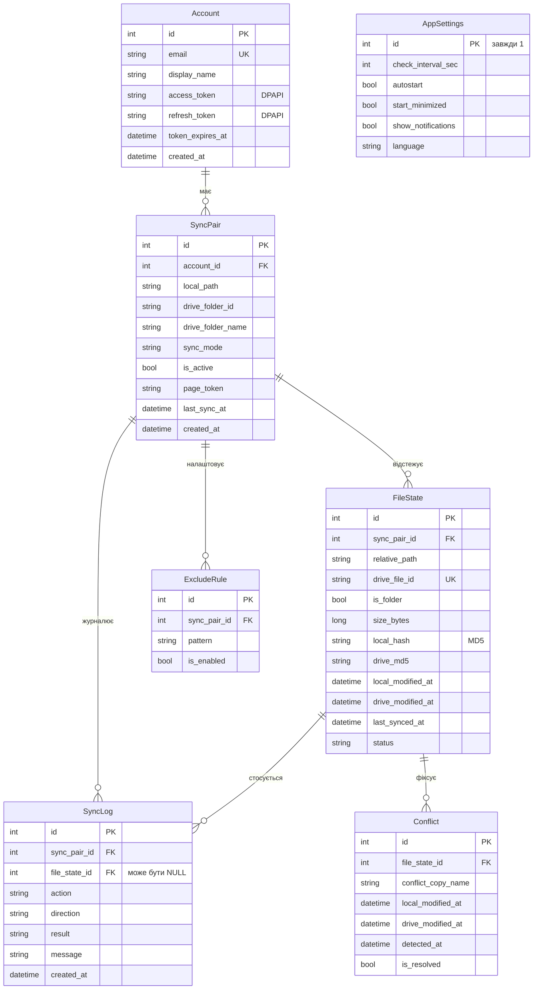

# Модель даних MyCloudSync

SQL-скрипт створення схеми: [schema.sql](schema.sql). Його виконує `DatabaseInitializer` при першому запуску.

> Спрощена версія цієї моделі є в `docs/design/diagrams.md`.

## ER-діаграма

Та сама схема у вигляді зображення: [images/MyCloudSync_DB_schema.png](images/MyCloudSync_DB_schema.png) (редагована версія — [SVG](images/MyCloudSync_DB_schema.svg) для Figma).

## Типи даних у SQLite

SQLite має лише кілька власних типів, тому логічні типи з діаграми зберігаються так:

| Логічний тип | Тип у SQLite | Формат |
|---|---|---|
| int, long | `INTEGER` | число |
| string | `TEXT` | UTF-8 |
| bool | `INTEGER` | 0 або 1 (з обмеженням `CHECK`) |
| datetime | `TEXT` | ISO 8601 в UTC, напр. `2026-09-29T10:15:00Z` |
| enum (режим, статус, дія) | `TEXT` | назва значення з C#-enum, перевіряється `CHECK` |

## Опис таблиць

### Account — прив'язаний акаунт Google (FR-01, FR-02)

| Поле | Тип | Обмеження | Опис |
|---|---|---|---|
| `id` | INTEGER | PK | Ідентифікатор |
| `email` | TEXT | NOT NULL, UNIQUE | Email акаунта Google, показується в інтерфейсі |
| `display_name` | TEXT | | Ім'я користувача з профілю Google |
| `access_token` | TEXT | NOT NULL | Токен доступу до API (живе ~1 год), зашифрований DPAPI |
| `refresh_token` | TEXT | NOT NULL | Токен для отримання нового access token без повторного входу, зашифрований DPAPI |
| `token_expires_at` | TEXT | | Коли закінчується access token |
| `created_at` | TEXT | NOT NULL | Дата прив'язки |

### SyncPair — пара папок (FR-03, FR-04, FR-06, FR-11, FR-14)

| Поле | Тип | Обмеження | Опис |
|---|---|---|---|
| `id` | INTEGER | PK | Ідентифікатор |
| `account_id` | INTEGER | FK → Account, NOT NULL | Акаунт, до якого належить пара |
| `local_path` | TEXT | NOT NULL | Повний шлях до локальної папки |
| `drive_folder_id` | TEXT | NOT NULL | ID папки в Google Drive (Drive ідентифікує файли за ID, а не за шляхом) |
| `drive_folder_name` | TEXT | | Назва папки для показу в інтерфейсі |
| `sync_mode` | TEXT | NOT NULL | `TwoWay`, `UploadOnly` або `DownloadOnly` |
| `is_active` | INTEGER | NOT NULL | 0 — синхронізацію призупинено |
| `page_token` | TEXT | | Закладка `changes.list`: з якого місця питати зміни в хмарі |
| `last_sync_at` | TEXT | | Час останньої успішної синхронізації |
| `created_at` | TEXT | NOT NULL | Дата створення пари |

Унікальна пара (`account_id`, `local_path`) не дає двічі додати ту саму папку.

### FileState — стан файлів (FR-05 – FR-09, FR-16)

| Поле | Тип | Обмеження | Опис |
|---|---|---|---|
| `id` | INTEGER | PK | Ідентифікатор |
| `sync_pair_id` | INTEGER | FK → SyncPair, NOT NULL | Пара папок |
| `relative_path` | TEXT | NOT NULL | Шлях відносно кореня пари (`Лаби/lab1.docx`) |
| `drive_file_id` | TEXT | UNIQUE | ID файлу в Google Drive; NULL, поки файл не вивантажено |
| `is_folder` | INTEGER | NOT NULL | 1 для папок |
| `size_bytes` | INTEGER | | Розмір, для швидкої перевірки змін |
| `local_hash` | TEXT | | MD5 локального вмісту під час останньої синхронізації |
| `drive_md5` | TEXT | | `md5Checksum` хмарної версії під час останньої синхронізації |
| `local_modified_at` | TEXT | | Дата зміни локального файлу |
| `drive_modified_at` | TEXT | | `modifiedTime` з Google Drive |
| `last_synced_at` | TEXT | | Коли файл востаннє успішно синхронізовано |
| `status` | TEXT | NOT NULL | `Synced`, `Pending`, `Error`, `Conflict`, `Skipped` |

Унікальна пара (`sync_pair_id`, `relative_path`): один запис на файл у межах пари.

### Conflict — конфлікти версій (FR-10)

| Поле | Тип | Обмеження | Опис |
|---|---|---|---|
| `id` | INTEGER | PK | Ідентифікатор |
| `file_state_id` | INTEGER | FK → FileState, NOT NULL | Файл, у якому стався конфлікт |
| `conflict_copy_name` | TEXT | NOT NULL | Назва копії з локальною версією |
| `local_modified_at` | TEXT | NOT NULL | Дата локальної версії |
| `drive_modified_at` | TEXT | NOT NULL | Дата хмарної версії |
| `detected_at` | TEXT | NOT NULL | Коли виявлено |
| `is_resolved` | INTEGER | NOT NULL | 1 — користувач позначив як розв'язаний |

### SyncLog — журнал операцій (FR-13)

| Поле | Тип | Обмеження | Опис |
|---|---|---|---|
| `id` | INTEGER | PK | Ідентифікатор |
| `sync_pair_id` | INTEGER | FK → SyncPair, NOT NULL | Пара папок |
| `file_state_id` | INTEGER | FK → FileState, NULL | Файл; NULL для подій без файлу («немає мережі») і після видалення запису файлу |
| `action` | TEXT | NOT NULL | `Upload`, `Download`, `Delete`, `Rename`, `Conflict`, `Skip`, `Error`, `Info` |
| `direction` | TEXT | | `ToCloud` або `FromCloud` |
| `result` | TEXT | NOT NULL | `Success`, `Warning`, `Error` |
| `message` | TEXT | | Назва файлу, текст помилки або пояснення |
| `created_at` | TEXT | NOT NULL | Час події |

### ExcludeRule — маски виключень (FR-14)

| Поле | Тип | Обмеження | Опис |
|---|---|---|---|
| `id` | INTEGER | PK | Ідентифікатор |
| `sync_pair_id` | INTEGER | FK → SyncPair, NOT NULL | Пара папок |
| `pattern` | TEXT | NOT NULL | Маска: `*.tmp`, `~$*`, `node_modules/` |
| `is_enabled` | INTEGER | NOT NULL | Правило можна вимкнути, не видаляючи |

Для нової пари автоматично створюються правила за замовчуванням: `*.tmp`, `~$*`, `desktop.ini`, `Thumbs.db`.

### AppSettings — глобальні налаштування (FR-12, FR-14, FR-15)

| Поле | Тип | За замовчуванням | Опис |
|---|---|---|---|
| `id` | INTEGER | 1 | Завжди один рядок (`CHECK (id = 1)`) |
| `check_interval_sec` | INTEGER | 300 | Інтервал перевірки хмари, 60–3600 с (у формі показується в хвилинах) |
| `autostart` | INTEGER | 0 | Запуск разом із Windows |
| `start_minimized` | INTEGER | 1 | Стартувати згорнутим у трей |
| `show_notifications` | INTEGER | 1 | Сповіщення Windows про конфлікти й помилки |
| `language` | TEXT | `uk` | Мова інтерфейсу |

## Зв'язки та цілісність

| Зв'язок | Тип | При видаленні батьківського запису |
|---|---|---|
| Account → SyncPair | 1 : N | `CASCADE`: пари акаунта видаляються разом з ним |
| SyncPair → FileState | 1 : N | `CASCADE` |
| SyncPair → ExcludeRule | 1 : N | `CASCADE` |
| SyncPair → SyncLog | 1 : N | `CASCADE` |
| FileState → Conflict | 1 : N | `CASCADE` |
| FileState → SyncLog | 1 : N | `SET NULL`: запис журналу лишається, посилання на файл обнуляється |

Каскадне видалення стосується лише записів у базі. Самі файли на диску та в Google Drive при видаленні пари не змінюються.

`PRAGMA foreign_keys = ON` вмикається при кожному відкритті з'єднання: без нього SQLite не перевіряє зовнішні ключі.

## Нормалізація

Схема відповідає **третій нормальній формі (3НФ)**:

- **1НФ** — усі значення атомарні. Маски виключень зберігаються окремими рядками в `ExcludeRule`, а не списком через кому.
- **2НФ** — у кожної таблиці простий первинний ключ `id`, тож часткових залежностей немає.
- **3НФ** — немає транзитивних залежностей. Наприклад, email акаунта зберігається лише в `Account`, а `SyncPair` посилається на нього через `account_id`.

Конфлікти винесено в окрему таблицю, а не в поля `FileState`: вони рідкісні, і інакше більшість рядків мала б порожні поля.

## Індекси

| Індекс | Для якого запиту |
|---|---|
| UNIQUE (`sync_pair_id`, `relative_path`) у FileState | Пошук стану файлу за шляхом — найчастіша операція циклу синхронізації |
| UNIQUE `drive_file_id` у FileState | Зіставлення змін із `changes.list` із записами |
| `ix_FileState_status` (`sync_pair_id`, `status`) | Файли з помилками або в очікуванні |
| `ix_SyncLog_created` (`sync_pair_id`, `created_at DESC`) | Останні записи журналу в LogForm, очищення старих записів |
| `ix_Conflict_open` (`is_resolved`, `detected_at DESC`) | Нерозв'язані конфлікти для сповіщень |

## Життєвий цикл даних

| Подія | Що відбувається в базі |
|---|---|
| Перший запуск | `DatabaseInitializer` створює таблиці, рядок `AppSettings`, `user_version = 1` |
| Вхід у Google | Новий рядок `Account` із зашифрованими токенами |
| Збереження пари папок | Рядок `SyncPair` + правила `ExcludeRule` за замовчуванням |
| Перша синхронізація | Рядки `FileState` для всіх файлів, `page_token` у `SyncPair` |
| Кожна операція з файлом | Оновлення `FileState` + запис `SyncLog` в одній транзакції |
| Конфлікт | Рядок `Conflict`, у `FileState.status = 'Conflict'` |
| Старт програми | Видалення записів `SyncLog`, старших за 30 днів |
| Вихід з акаунта | Токени відкликаються в Google, рядок `Account` і всі пов'язані дані видаляються каскадом |
| Нова версія програми | `DatabaseInitializer` порівнює `user_version` і виконує потрібні скрипти оновлення схеми |

Оновлення `FileState` і запис у `SyncLog` виконуються в одній транзакції. Якщо програма аварійно завершиться посеред операції, база не залишиться в неузгодженому стані (NFR-03).
