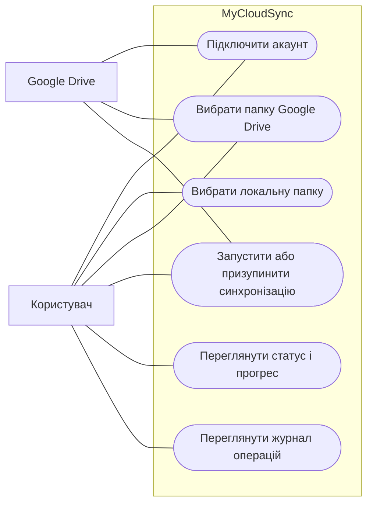
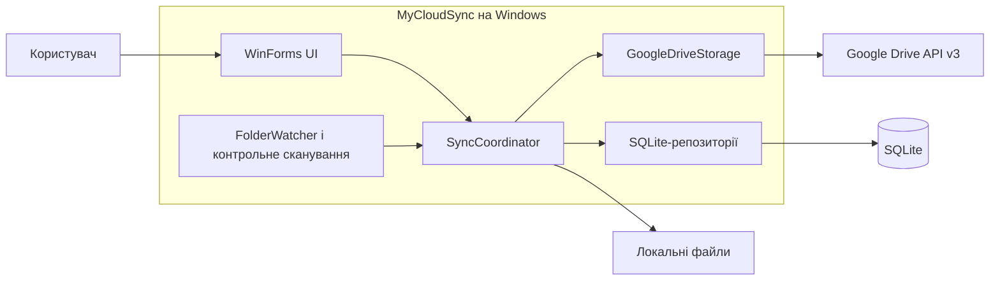
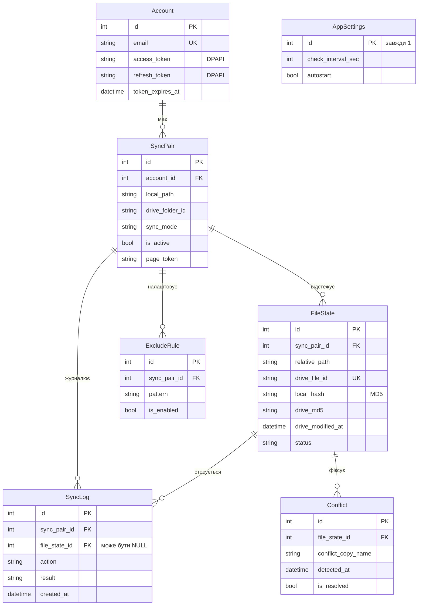

# Діаграми MyCloudSync

## Варіанти використання

## Компоненти й потік взаємодії

## Послідовність синхронізації

## Модель даних

Спрощена ER-діаграма з ключовими полями. Повний опис усіх полів, типів, індексів і SQL-скрипт створення бази — у [docs/architecture/data-model.md](../architecture/data-model.md).

`AppSettings` — глобальні налаштування, тому в схемі вона не пов’язана з конкретною парою папок. OAuth-токени шифруються засобами Windows DPAPI.
