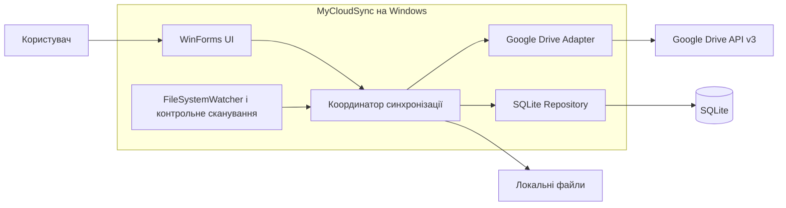
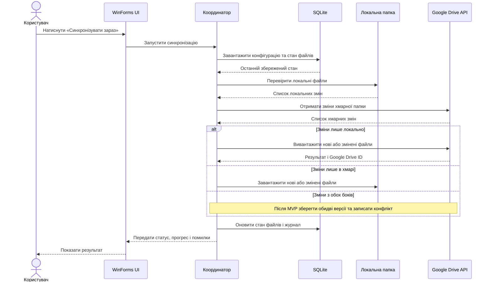
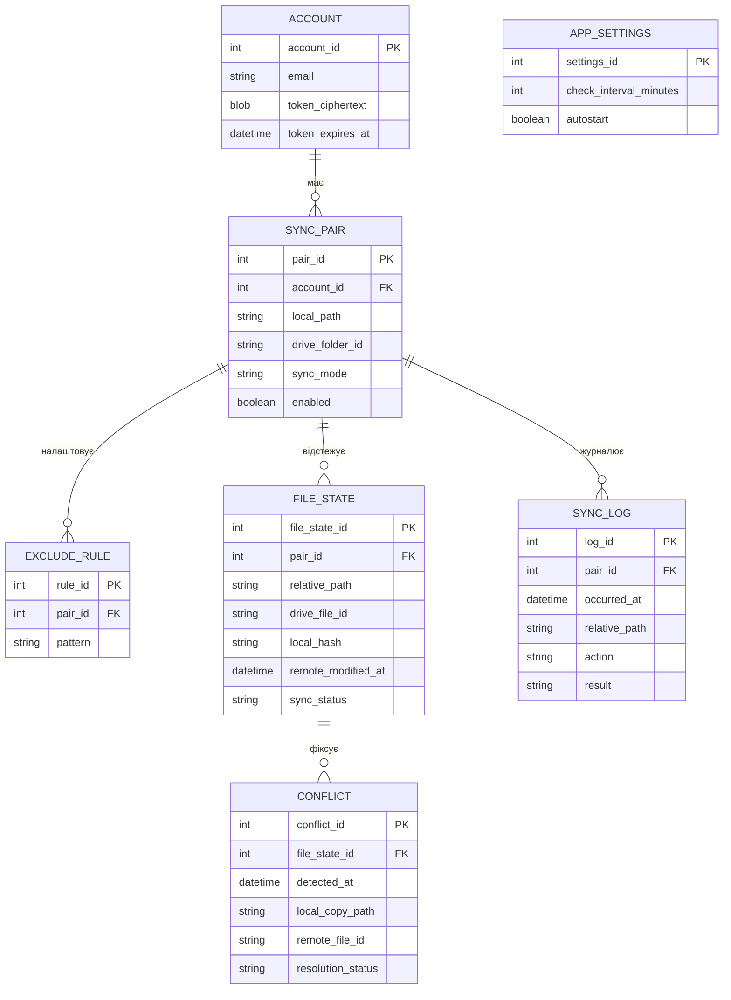

# Діаграми MyCloudSync

Діаграми вбудовані в Markdown, тому GitHub відображає їх без окремих програм чи розширень. Їхній текст можна редагувати прямо в цьому файлі.

## Варіанти використання

## Компоненти й потік взаємодії

## Послідовність синхронізації

## Модель даних

`APP_SETTINGS` — глобальні налаштування, тому в схемі вона не пов’язана з конкретною парою папок. OAuth токен потрібно захистити засобами Windows DPAPI.
